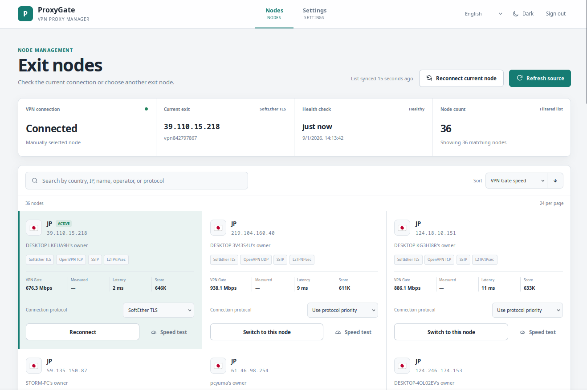
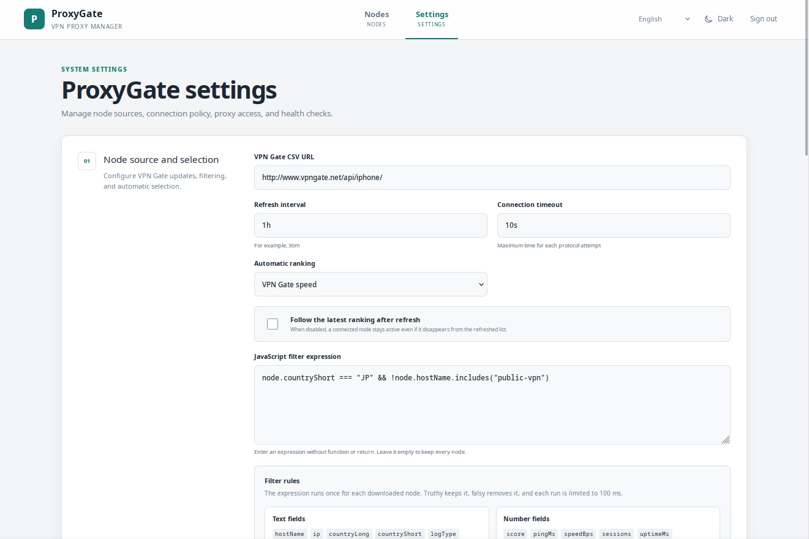

# ProxyGate

ProxyGate turns public VPN Gate nodes into a managed SOCKS5 proxy. It downloads and filters the node list, connects through supported VPN protocols, and exposes connection controls through a lightweight web interface.

<div align="center">
  
  <br />
  
</div>

## Features

- No elevated permissions or `/dev/net/tun` device required
- Support for OpenVPN UDP/TCP, SoftEther TLS, SSTP, and L2TP/IPsec
- Optional SOCKS5 authentication with username and password
- Automatic ranking, health checks, and failover
- Manual node and protocol selection
- On-demand speed testing with configurable URL and timeout
- In-process service and application restart support

Node changes are transactional: ProxyGate connects to the candidate, performs a health check, and only then switches SOCKS5 traffic to the new session. If the attempt fails, the current connection remains unchanged.

## Build

Go 1.26.6 and Node.js with npm are required. The Makefile builds the frontend assets before producing the Go binary:

```sh
make build
```

The output binary is written to `build/dist`, and the Vite bundle is embedded into the executable. If you only need a specific stage, use `make web`, `make core`, or `make lint`.

## Run

```sh
./build/dist/proxygate -config ./config.json
```

To print embedded build information, run:

```sh
./build/dist/proxygate -version
```

The same data is also exposed via `GET /api/version` without authentication. It describes the running binary only and does not check for updates.

On the first run, `config.json` is created automatically. By default, the web interface listens on `127.0.0.1:8080` with the credentials `admin` / `admin`, and the SOCKS5 proxy listens on `127.0.0.1:1080`. Change the web password after signing in.

An empty database triggers an initial source refresh and automatic node selection. If a later refresh fails, the existing nodes remain available.

## Docker

```sh
docker build -t proxygate .
docker run --rm -p 8080:8080 -p 1080:1080 -v proxygate-data:/data proxygate
```

The container stores its generated configuration and SQLite database in `/data`. The listen addresses and database path can be overridden with `PROXYGATE_WEB_LISTEN_ADDRESS`, `PROXYGATE_SOCKS5_LISTEN_ADDRESS`, and `PROXYGATE_DATABASE_PATH`.

Tags such as `v0.1.0` produce GitHub release archives and a multi-platform image in the repository's GHCR package. Pre-release tags such as `v0.1.0-rc.1` are marked accordingly and do not overwrite `latest`.

## Configuration

Settings are stored in local JSON. The web listen address, SOCKS5 listen address, and database path require a restart; other connection settings take effect without restarting. The application can also be restarted from the settings page.

Useful networking settings include:

- `dnsServers`: ordered IPv4 DNS-over-TCP endpoints such as `1.1.1.1:53`
- `speedTestUrl`: download URL used for manual speed tests
- `speedTestTimeout`: maximum speed-test duration; partial downloads still produce an average speed
- `monitor.url`: health-check endpoint

Configuration and database schemas do not include compatibility logic for older versions. When a schema changes, use a current configuration and a fresh database.

## Node filters

The filter is a JavaScript expression evaluated once for each downloaded node. A truthy result keeps the node, while an empty value keeps all valid entries.

```js
node.countryShort === "JP" &&
  node.pingMs > 0 &&
  node.pingMs < 100 &&
  node.protocols.includes("openvpn_udp") &&
  !includesIgnoreCase(node.operatorMessage, "academic use only");
```

Text fields include `hostName`, `ip`, `countryLong`, `countryShort`, `operator`, and `operatorMessage`. Numeric fields include `score`, `pingMs`, `speedBps`, `sessions`, `uptimeMs`, `totalUsers`, and `totalTraffic`. The `protocols` array contains the protocols detected for the node.

Two helper functions are available:

- `cidrContains(cidr, ip)` checks whether an IP address falls within a CIDR range
- `includesIgnoreCase(value, search)` performs a case-insensitive substring check

Each evaluation is limited to 100 ms. Invalid syntax prevents the setting from being saved, while a runtime error aborts the refresh without deleting the existing node list.
